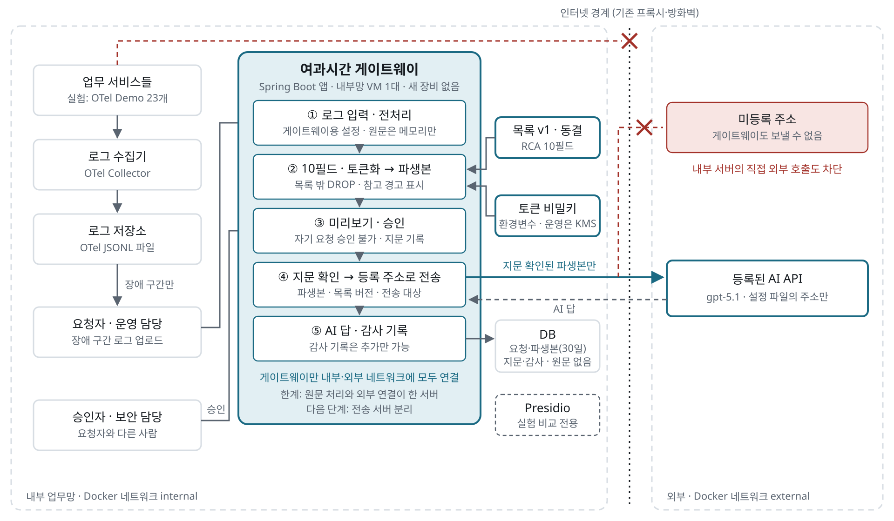

# 여과시간 Architecture

## 배치: 어디에 서서 무엇을 받는가

여과시간은 **네트워크 장비가 아니라 사내 서버에서 도는 애플리케이션 소프트웨어**다. 네트워크를 지나는 패킷을 가로채거나 검사하지 않는다. 장애가 났을 때, 이미 수집된 애플리케이션 로그 가운데 그 사건 구간만 꺼내 처리한다. MVP에서는 담당자가 장애 구간 로그 파일(OTel JSONL)을 골라 올린다.

그림은 6주차 게이트웨이 설계안 v0.2 기준이다(10필드 동결, 요청자·승인자 분리, 승인 지문, 토큰 비밀키, 게이트웨이 한 대의 한계). 발표·문서용 이미지는 [architecture.png](architecture.png), 원본은 [architecture.svg](architecture.svg)다.

~~~text
[평소]   서비스들 ──OTLP──▶ OTel Collector ──▶ 로그 저장소        (여과시간은 관여하지 않음)

[장애]   알람 또는 운영자가 사건 입력 (시간 구간 + 관련 서비스)
             │
             ▼
         여과시간 ── 로그 저장소에서 그 구간만 조회
             │  1. 업무(Purpose) 목록에 있는 칸만 담기, 나머지 DROP
             │  2. 식별자는 사건 범위 토큰으로 변환
             │  3. 담긴 내용을 사람이 확인·승인
             ▼
         Egress Dispatcher ──▶ 등록된 외부 AI 1곳  (사내망에서 유일한 AI 출구)
             │
             ▼
         결과 + 감사 기록 (누가, 무엇을, 언제 보냈나)
~~~

| 질문 | 답 |
| --- | --- |
| 하드웨어인가 소프트웨어인가 | 소프트웨어. Spring Boot 애플리케이션과 별도 Dispatcher 컨테이너 |
| 무엇을 입력으로 받는가 | OTel Collector가 이미 모은 애플리케이션 로그(OTLP JSON). 패킷·파일·화면은 받지 않는다 |
| 언제 동작하는가 | 장애 알람 뒤 사건 단위로 한 번. 상시·실시간 트래픽 경로에 서지 않는다 |
| 기록마다 맞다·틀리다를 판단하는가 | 아니다. 미리 승인한 칸 목록으로 기계적으로 거른다. 원인 판단은 AI가, 반출 승인은 사람이 한다 |
| 장애 탐지를 하는가 | 아니다. 탐지는 기존 모니터링(에러율·지연 알람)의 일이다 |

### 대상 네트워크 환경

| 환경 | 설명 | 여과시간 적용 |
| --- | --- | --- |
| 물리적 망분리 | 업무망과 인터넷망이 물리적으로 따로 있고, PC도 따로 쓴다. 은행 업무망, 행정망이 그 예다 | **대상 아님.** 업무망에서 외부 AI로 가는 길 자체가 없다 |
| 논리적 망분리 | PC 한 대에서 가상화·VDI·접근통제로 망을 나눈다 | **주 대상.** 사내 구역에서 외부로 나가는 통제된 출구가 하나 있고, 여과시간이 그 출구 앞에서 AI 반출 내용을 정한다 |
| 망분리 의무가 없거나 완화된 조직 | 핀테크, 이커머스, 일반 기업 등. 외부 AI를 이미 쓴다 | **주 대상.** 운영자가 로그를 직접 붙여 넣는 대신 여과시간을 거치게 한다 |

금융위원회는 2024-08-13 [「금융분야 망분리 개선 로드맵」](https://www.fsc.go.kr/no010101/82885)을 발표했다. 규제 샌드박스(혁신금융서비스 지정)를 받은 금융회사는 생성형 AI로 **가명처리된 개인신용정보까지** 처리할 수 있고, 보안대책과 AI 사업자 계약 필수 내용이 부가조건으로 붙는다. 여과시간의 목록 기반 반출·사건 범위 토큰·반출 기록은 이런 조건을 맞추는 수단 후보다. 로드맵 이후 법령 개정 진행 상황은 확인하지 못했다.

## DPI·방화벽과의 차이

| | DPI·차세대 방화벽 | 여과시간 |
| --- | --- | --- |
| 계층 | 네트워크 (패킷) | 애플리케이션 (로그의 칸) |
| 위치 | 모든 트래픽이 지나는 길목(inline) | 트래픽 경로 밖. 로그 저장소에서 필요할 때 조회 |
| 처리량 | 조직 전체 트래픽, 실시간 | 사건 하나의 로그 구간, 장애 때만 |
| 판단 방식 | 패턴·시그니처로 내용을 탐지해 통과·차단 | 업무별 칸 목록으로 담기. 내용 탐지를 하지 않음 |
| 지연 영향 | 트래픽이 늘수록 모든 통신이 느려질 수 있다 | 서비스 통신에 끼지 않으므로 지연을 더하지 않는다 |

DPI는 모든 패킷을 inline으로 검사하다 보니 트래픽이 커지면 지연이 문제가 된다. 여과시간은 이 경로에 서지 않는다. 대신 사람이 확인하는 동안 기다리는 시간은 여과시간의 비용이며, 이는 장애 대응 시간에 더해진다.

## 게이트웨이 자체 보안

여과시간은 원본 로그를 보므로, 여과시간이 뚫리면 원본이 샌다. 아래를 위협 모델로 둔다. `구현`은 현재 코드에 있는 것, `설계`는 아직 문서 단계인 것이다.

| 위협 | 대책 | 상태 |
| --- | --- | --- |
| 여과시간 서버 침해 | 사내망 OTel Collector와 같은 보안 구역에 둔다. Collector가 이미 가진 로그 이상을 보지 않으므로 새 공격 면을 최소화한다. 원본은 저장하지 않고 rawHash만 남긴다 | 설계 |
| 목록(Purpose) 변조 | 목록은 Git으로 관리하고 DRAFT→SECURITY_REVIEW→ACTIVE 승인을 거친다(POLICY-06). 활성 목록의 해시를 감사 기록과 승인 fingerprint에 넣는다(POLICY-05) | 설계 |
| 여과시간 우회 | 사내망에서 외부 AI로 나가는 연결은 Egress Dispatcher만 허용한다. 사람이 손으로 복사해 붙여 넣는 것은 기술로 완전히 막지 못하며 사내 정책의 몫이다 | 설계 (Docker network 격리로 PoC) |
| 목록에 없는 새 칸 | 모르는 칸은 기본 DROP (`onUnknownField: DROP`) | 구현 |
| 여과시간 오류·설정 로드 실패 | 아무것도 보내지 않는다(fail-closed) | 부분 구현 (목록 밖 DROP), 전 단계 적용은 설계 |
| 토큰 되짚기 | 토큰은 HMAC(서버 비밀키, caseId + 값)이다. caseId를 섞어 사건끼리 토큰이 연결되지 않고, 비밀키를 모르면 값을 대입해 되짚을 수 없다. 2026-09-30 전에는 caseId를 키로 써서 caseId만 알면 되짚을 수 있었다 | 구현 (`YG_TOKENIZE_SECRET`) |
| 토큰 비밀키 유출 | 키 하나가 새면 모든 사건의 토큰이 대입 공격에 노출된다. 운영에서는 키를 KMS에 두고 주기적으로 교체한다. 토큰은 앞 8자리(32비트)만 쓰므로 한 사건에 식별자가 수만 개면 충돌이 생길 수 있다 | KMS·길이 조정은 설계 |
| 담은 칸 안에 섞인 값 | `body`, `exception.message` 안의 ID는 칸 단위로 막을 수 없다. 반출 전 사람 확인에서 걸러야 한다 | 한계로 기록 |

실패했을 때 방향이 빼기와 반대라는 점이 핵심이다. 빼기 방식의 탐지기가 고장 나면 원본이 그대로 나간다. 여과시간은 고장 나면 아무것도 나가지 않는다.

## 구조

~~~mermaid
flowchart LR
  U[Internal Client / React] --> API[Spring Boot API]
  API --> SEC[Spring Security]
  API --> REG[Purpose Registry]
  API --> CLS[Classification]
  API --> PKG[Package Builder]
  API --> POL[Policy Engine]
  API --> RES[Residual Scanner]
  API --> APR[Approval]
  API --> AUD[Audit]
  API --> DB[(PostgreSQL)]
  API --> T2[T2 Private AI / Mock]
  API --> DIS[Dispatcher]
  DIS --> T1[T1 Controlled Receiver / Approved AI]
  BENCH[Benchmark Runner + Gold] -. no runtime access .-> API
~~~

## 컴포넌트 책임과 경계

| 구성요소 | 책임 | 왜 분리하는가 | 입력/출력 |
| --- | --- | --- | --- |
| React Workspace | 요청·비교·검토·결과·감사 UI | 보안 규칙을 UI에 두지 않고 서버 판정을 표시하기 위해 | API DTO / 사용자 Action |
| Spring Boot API/Orchestrator | 요청 lifecycle과 상태 전이 조정 | 흐름 순서와 transaction 경계를 한 곳에서 강제하기 위해 | requestId / state·DTO |
| Spring Security | 인증·역할·자기승인 금지 | Purpose 권한과 reviewer 권한을 업무 로직에서 분리하기 위해 | principal / 401·403 |
| Purpose Registry | versioned Purpose 계약 제공 | 자유문장 추론 대신 승인된 계약만 쓰기 위해 | purposeCode / field rules |
| Classification | parse·finding·관계 후보 생성 | 탐지 결과를 변환·정책과 독립적으로 검증하기 위해 | raw JSON / Finding |
| Package Builder | 최소 패키지·manifest·hash 생성 | 목적별 선택과 변환을 결정적으로 재현하기 위해 | findings+template / package+manifest |
| Policy Engine | role·Purpose·Trust·dataClass 판정 | 정책 설명과 allow/deny를 변환 코드와 분리하기 위해 | context / decision+explain |
| Residual Scanner | 변환 후 금지값 재검사 | 최초 detector miss가 외부 전송으로 이어지지 않게 하기 위해 | package / pass·finding |
| Approval | fingerprint 기반 승인·무효화 | 검토 결정이 정확한 패키지에만 적용되게 하기 위해 | fingerprint / approval status |
| AI Adapter | T2/T1 공통 호출·결과 변환 | provider 차이를 흐름 코드에서 격리하기 위해 | package / execution result |
| Egress Dispatcher | 등록 T1 목적지만 외부 연결 | 원본 처리 API에 외부 egress 권한을 주지 않기 위해 | destinationId+package / receiver response |
| Audit | append-only lifecycle 증거 | 원문 없이 결정·실행을 설명하기 위해 | event / ordered history |
| PostgreSQL | 상태·version·approval·audit 관계 저장 | transaction·조회·제약을 일관되게 유지하기 위해 | entities / durable records |
| Benchmark Runner | B3/P 실행·Gold scoring | Gold가 운영 runtime으로 새지 않게 하기 위해 | frozen config / report |

Purpose Registry, Classification, Package Builder, Policy Engine, Residual Scanner, Approval, Audit은 MVP에서 별도 컨테이너가 아닌 Spring Boot 내부 모듈이다. Dispatcher만 외부 egress 경계를 위해 별도 배포 단위로 둔다.

## Docker Network

~~~mermaid
flowchart LR
  C[internal-client] --- N1[internal_net: internal]
  API[yeogwasigan-api] --- N1
  API --- N2[data_net: internal]
  DB[(postgres)] --- N2
  T2[t2-mock] --- N2
  API --- N3[dispatch_net: internal]
  D[egress-dispatcher] --- N3
  D --- N4[egress_net]
  T1[t1-receiver or approved AI] --- N4
  C -. direct blocked .-> T1
~~~

- internal_net, data_net, dispatch_net은 Docker Compose internal network다.
- internal-client는 internal_net만 연결한다.
- yeogwasigan-api는 원본·패키지·정책을 처리하지만 egress_net에는 연결하지 않는다.
- egress-dispatcher만 egress_net에 연결한다. Dispatcher는 destinationId를 allowlist에서 해석하고 사용자 입력 URL을 받지 않는다.
- DB, T2, Dispatcher 포트는 host에 publish하지 않는다. 데모 UI만 loopback 포트를 publish한다.
- Docker network만으로 Dispatcher가 침해된 뒤의 전체 인터넷 egress를 완전 차단한다고 주장하지 않는다. 목적지 allowlist는 Dispatcher 정책으로 보완한다.

## 데이터 흐름과 실패 닫힘

1. API는 raw payload를 Object Store 또는 암호화된 개발 저장소 참조로 두고 rawHash만 DB/Audit에 저장한다.
2. Classification과 Package Builder가 manifest, derivedHash, derivedObjectRef를 만든다.
3. Policy와 Residual Scan이 통과해야 Dispatcher에 패키지를 건넨다.
4. Audit intent를 저장하지 못하면 외부 실행하지 않는다.
5. parser/detector/policy/scanner failure는 T1에서 REVIEW_PENDING 또는 DENIED다.
6. Dispatcher는 패키지와 등록 목적지만 받고 raw 원문 저장소와 DB 권한을 갖지 않는다.
7. Benchmark Runner는 별도 계정·이미지·volume에서 Gold를 읽는다. runtime API, database, container에는 Gold mount 또는 endpoint가 없다.

## 기술 선택

| 기술 | MVP 사용 | 이유 |
| --- | --- | --- |
| React | 5개 Workspace 화면 | package diff와 상태를 명확히 보여줌 |
| Spring Boot + Spring Security | workflow, API, role | 검증 가능한 상태·권한 구현 |
| JPA + PostgreSQL | 9개 핵심 entity | version·approval·audit 관계 |
| Docker Compose | 내부·egress 경계 | 재현 가능한 network evidence |
| 정규식/schema detector 또는 Presidio | Classification | 자체 탐지 모델 개발을 범위에서 제외 |
| T2 mock/local, T1 receiver/실제 AI | adapter 검증 | Trust별 실행 결과 |

OPA, Prometheus/Grafana, nftables/tcpdump 고도화는 P2다.
